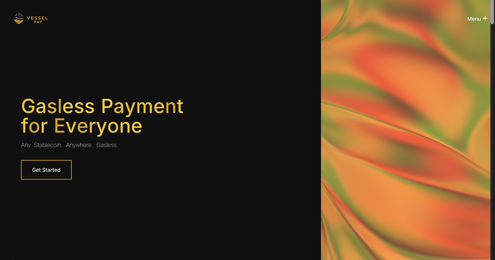

# Vessel-Pay



Vessel-Pay is a gasless stablecoin cross-border payment dApp on Base Sepolia and Etherlink Shadownet. Build for payment app that support every user needed. Allows people to make transactions without Base ETH and Etherlink XTZ, just pay gas fees with stablecoin because paymaster (ERC-4337). This repository
contains the smart contracts, backend services, and frontend web app.

## Features

- **Multichain**: Support Base Sepolia and Etherlink Shadownet
- **Gasless activation**: One-time token approval sponsored by the paymaster
- **Gasless transactions**: Gasless every transactions
- **Base App login**: Supports Coinbase Base App and Privy wallets
- **Multi-token payments**: Pay in any supported stablecoin
- **Batch transfers**: Send to multiple recipients in one transaction
- **ENS support**: Send to Base mainnet and Etherlink mainnet ENS names (via mainnet resolver)
- **QR payments**: Generate and scan payment requests
- **QRIS Supported**: Pay to QRIS (Quick Response Code Indonesian Standard)
- **Stablecoin swaps**: Auto-swap during payments via StableSwap
- **IDRX top-up**: Integrated IDRX API flow (backend-assisted)

## Projects

- `Vessel-Pay-sc` - Smart contracts (ERC-4337 paymaster, swap, payment processor)
- `Vessel-Pay-be` - Backend signer, IDRX API integration, and swap helpers (Express)
- `Vessel-Pay-fe` - Frontend web app (Next.js)

## Quick Start

Follow the README inside each project:

- Smart contracts: `Vessel-Pay-sc/README.md`
- Backend: `Vessel-Pay-be/README.md`
- Frontend: `Vessel-Pay-fe/README.md`

## Local Dev (Short Version)

```bash
# Backend
cd Vessel-Pay-be
npm install
cp .env.example .env
npm run dev

# Frontend
cd ../Vesssel-Pay-fe
npm install --legacy-peer-deps
cp .env.example .env
npm run dev
```

## Notes

- Make sure contract addresses and RPC URLs are consistent across `.env` files.
- The backend signer must be added as an authorized signer on the Paymaster.
